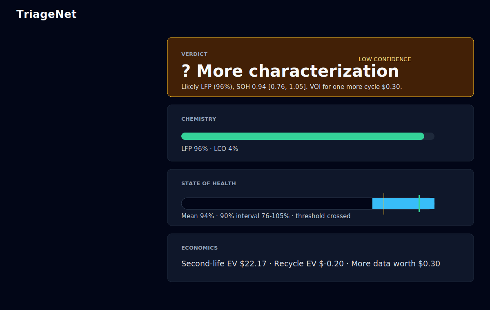
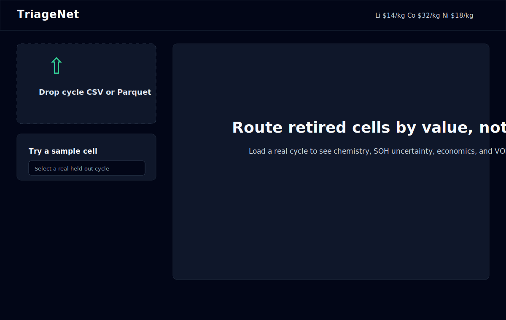
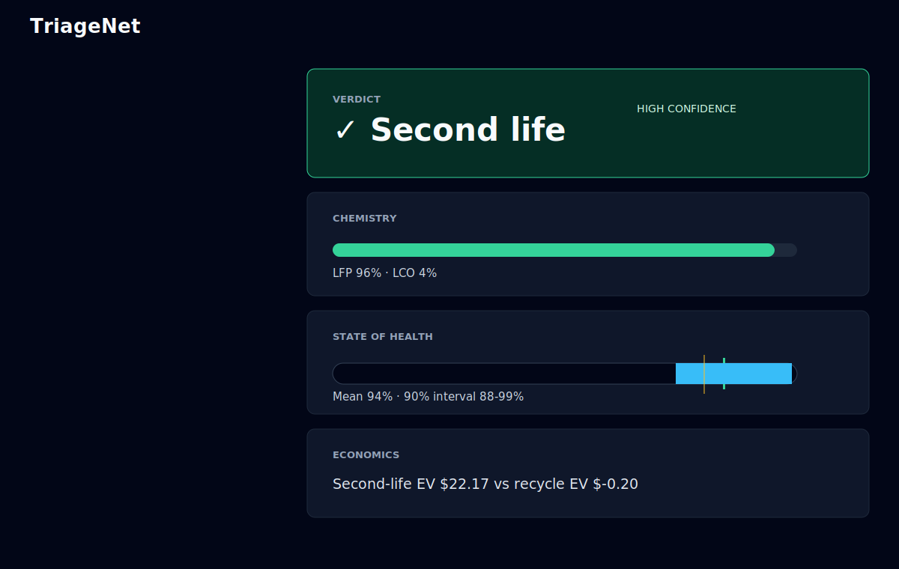

# TriageNet

TriageNet is a single-cycle lithium-ion battery triage system for recycling intake. It
combines chemistry probabilities, shape-based SOH inference with calibrated intervals, and
techno-economic routing so an operator can decide whether a cell should go to second life,
direct recycling, or one more characterization cycle.



## The Problem

Battery recyclers need to route incoming retired cells quickly. A healthy cell may be worth more
as stationary storage; a degraded or cobalt-rich cell may be worth more through direct material
recovery. The hard part is making that call from one characterization cycle while accounting for
uncertainty and market value, not just a rigid SOH threshold.

## Approach Overview

- **Chemistry classifier:** predicts LFP vs LCO from voltage-normalized cycle shape features.
- **SOH regressor:** predicts SOH from shape only, excluding direct capacity features, and returns
  a 90% prediction interval.
- **Triage engine:** converts chemistry, SOH uncertainty, commodity prices, and second-life value
  into a risk-aware business verdict.

## Headline Results

| Layer | Result |
| --- | ---: |
| Chemistry, shape features under -0.2 V shift | 99.93% balanced accuracy |
| Chemistry, absolute-voltage baseline under -0.2 V shift | 87.09% balanced accuracy |
| SOH ensemble XGB RMSE | 0.0268 SOH |
| SOH ensemble XGB PICP@90 | 0.9269 |
| Triage uplift vs naive threshold | $1.47/cell, 8.41% |
| Risk-aware decision distribution | 203 second-life / 57 recycle / 5 more-characterization |

## Methodology Highlights

### The Leakage Chain

The first classifier result looked too good. CALCE LCO cells were cycled to roughly 5% SOH, while
MIT/Stanford LFP cells stop near 80% SOH. A naive classifier can read SOH and appear brilliant.
Phase 2 fixed that with a matched SOH window of [0.80, 1.00].

The next audit removed absolute voltage range as a shortcut. LFP and LCO operate in different
voltage windows, so Phase 2.5 added voltage-normalized shape features and a +/-0.2 V robustness
probe. That made the model more defensible, but it also revealed the real ceiling: c-rate/protocol
still separates the two current datasets. With one LCO source and one LFP source, dataset identity
is mathematically inseparable from chemistry identity.

### Why Uncertainty Is The Headline

The SOH model intentionally predicts capacity health without seeing capacity. Direct capacity
ratio is the target, so it is excluded from the feature list. The model consumes voltage-normalized
shape, dQ/dV signatures, c-rate, and degradation-shape features, then returns a calibrated interval.

The demo case is `calce_cs2_33` cycle 865. Its mean SOH is high, but the interval crosses the 80%
second-life threshold, so the risk-aware triage rule does not force a deterministic route. It sends
the cell to more characterization, which is exactly the behavior a point-estimate flowchart misses.

### Value Of Information

Phase 4 estimates recycle value, second-life value, and the value of one more characterization
cycle. If the expected-value gap is smaller than the value of additional information, the system
returns `needs_more_characterization`. That converts model uncertainty into an operator action and
a dollar value.

## What's Honestly Unproven

The chemistry classifier is still bounded by a two-dataset world. CALCE is LCO and MIT/Stanford is
LFP, so c-rate, lab protocol, manufacturer, and chemistry remain entangled. Sandia's multi-chemistry
single-lab dataset is the highest-value acquisition because it decouples chemistry from source.

Commodity prices use a documented late-April-2026 snapshot fallback when no live API is configured.
Per-cell economics are scaled from literature values; Bridge Green's internal yields, testing costs,
small-cell-equivalent processing costs, and pack-level process economics would replace these
constants in production.

## Repository Tour

```text
api/                    FastAPI service and typed schemas
frontend/               Vite + React + TypeScript dashboard
src/triagenet/io/       Dataset loaders and UnifiedCycle validation
src/triagenet/features/ Single-cycle feature extraction
src/triagenet/models/   Chemistry, SOH, calibration, and triage logic
src/triagenet/economics Recovery, commodity prices, and valuation
scripts/                Download, training, probing, and evaluation scripts
reports/                Phase diagnostics and metrics
docs/                   Architecture, screenshots, and walkthrough script
models/                 Serialized trained models and metadata
```

## Reproducibility

```bash
bash scripts/download_datasets.sh
python -m triagenet.cli ingest
uv run uvicorn api.main:app --reload --port 8000
cd frontend && npm install && npm run dev
```

The dashboard runs at `http://localhost:5173`. Upload a `.csv` or `.parquet` cycle file, or use
the sample-cycle picker. Dataset attribution: CALCE Battery Research Group, MIT/Stanford Severson
2019 Toyota Research Institute data, and NASA PCoE as a documented backup source.

## Architecture

See [docs/architecture.md](docs/architecture.md) for the data-flow diagram and design notes.

## Screenshots






## Roadmap

1. Add Sandia data for same-lab LFP/LCO/NMC/NCA chemistry separation.
2. Replace literature economics with Bridge Green process yields and pack-level costs.
3. Integrate a live commodity-price feed and deploy the API/dashboard in a container.

## Acknowledgments

This project uses public battery-aging datasets and methodology inspired by Severson 2019, Roman
2021, Casals 2019, Velazquez-Martinez 2019, Harper 2019, and second-life economics literature.
Bridge Green Upcycle is the operational inspiration for the triage framing.
