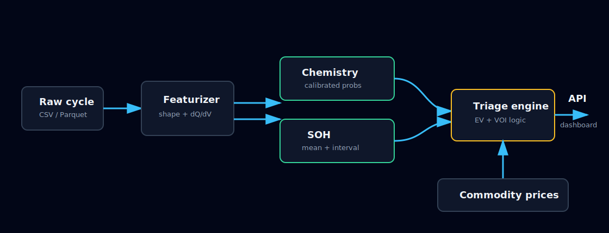

# Architecture

TriageNet is intentionally split into narrow layers. Each layer emits typed artifacts that the next
layer can inspect, test, and explain.

The raw cycle is first normalized to the `UnifiedCycle` schema. The featurizer extracts only
single-cycle features: voltage-normalized shape descriptors, dQ/dV signatures, c-rate fields, and
degradation-shape features. Chemistry prediction and SOH prediction are separate heads because the
SOH ensemble needs chemistry uncertainty, not just a hard class label.

The triage engine is not an ML model. It is a deterministic decision layer that consumes chemistry
probabilities, SOH intervals, commodity prices, and recovery/second-life assumptions. This keeps the
business logic auditable: changing lithium prices or Bridge Green's process costs changes the
verdict through explicit economics rather than hidden model behavior.

The FastAPI service loads the saved model artifacts once at startup. The React dashboard sends raw
cycle payloads or uploaded files to the backend, then renders the returned verdict JSON without
recomputing model logic in the browser.
